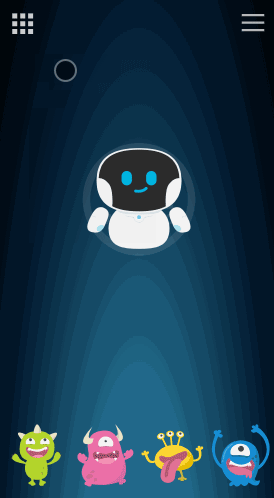
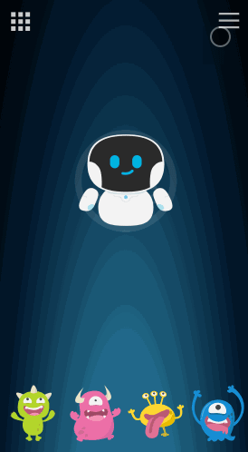
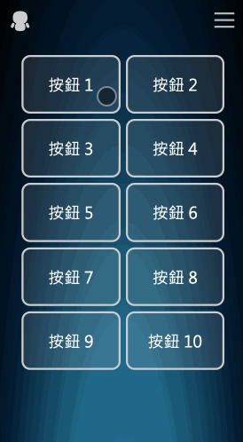
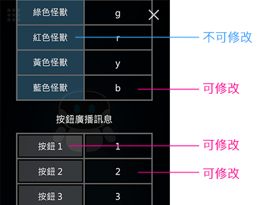
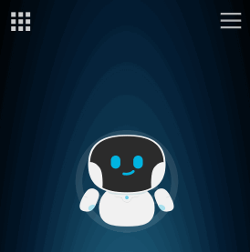
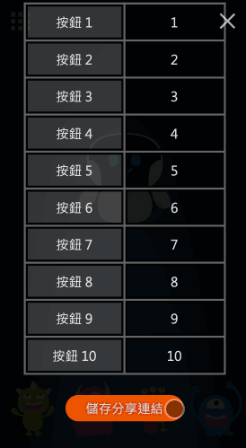
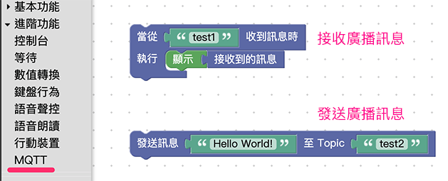
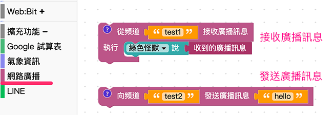
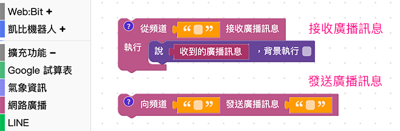

# Webduino Remote 萬用遙控器

這是針對 Webduino 所設計的萬用遙控器，可以透過虛擬機器人搖桿或十顆按鈕發送網路廣播訊號，輕鬆串連物聯網的各種生活體驗。

> 網址：[https://www.oxxostudio.tw/webduino-remote/](https://www.oxxostudio.tw/webduino-remote/)

 ( 由於一些軟體內建的瀏覽器，手勢下拉時會關閉畫面，因此比較建議使用手機的 Chrome 操作 )

 
 

## 選單介紹

上方左側按鈕：點擊可切換兩種遙控器畫面，分別是「**虛擬機器人搖桿**」和「**十顆按鈕**」。

右上方的按鈕：點擊可以開啟廣播訊息設定畫面。

 
 

## 操作說明

### 1. 虛擬機器人搖桿

透過拖拉中間的 Kebbi 虛擬機器人模擬搖桿行為，支援上下左右四個方向，拖曳到該方向就會發送對應訊號，若放開機器人 ( 會自動返回中間 ) 或拖曳機器人到中間圓型區域，就會發送停止的訊號。

下方四個小怪獸可以作為按鈕使用，直接點擊就能發送對應訊號。

 

### 2. 十顆按鈕

直接點擊按鈕就能發送對應訊號

 

### 3. 廣播訊息設定

廣播訊息設定畫面，可看到許多可以輸入的欄位，若欄位背景顏色為淺藍色表示**不能修改**。

設定廣播發送頻道名稱，表示拖曳虛擬機器人搖桿、點擊小怪獸按鈕、點擊十顆按鈕時，都會朝這個頻道發送訊號。

設定廣播接收頻道名稱，若從這個頻道接收到訊號，就會以類似推播的形式，顯示在畫面上方。( 三秒後訊息會自動消失 )

 

### 4. 存擋和分享

在廣播訊息設定畫面的最下方，有一個存檔案的按鈕，點擊後會儲存產生一組連結，複製這組連結再次打開，就能看到原本訊息設定的內容。

 
 

# Webduino 服務串接

### 1. Webduino 雲端平台串接

登入 Webduino 雲端平台 ( [https://cloud.webduino.io](https://cloud.webduino.io) )，使用 Blockly 程式積木裡進階功能的「*MQTT 積木*」，即可進行串接。

 

### 2. Web:Bit 教育版串接

開啟 Web:Bit 教育版 ( [http://webbit.webduino.io/](http://webbit.webduino.io/) )，使用擴充功能裡的「*網路廣播積木*」，即可進行串接。

> 範例展示：[https://webbit.webduino.io/blockly/?demo=default#EqdrNJvwYzQy6](https://webbit.webduino.io/blockly/?demo=default#EqdrNJvwYzQy6)

 

### 3. Web:Bit x Kebbi 串接

開啟 Web:Bit x Kebbi ( [http://kebbiiot.webduino.io/](http://kebbiiot.webduino.io/) )，使用擴充功能裡的「*網路廣播積木*」，即可進行串接。

## 程式

`mqttClient.js` 的內容，可參考票號 #5720。
